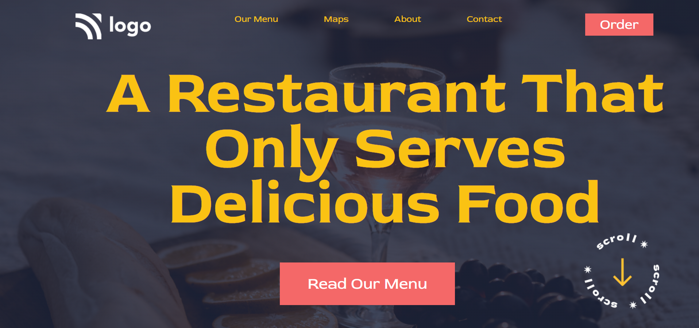

# Assignment 1

# Live Project 2 : Food Restaurant Home Page

## Project 2: [Live Link]()

-   Skills Gained in this project.
    -   Learnd to use css position property.
    -   Learned how to apply linear gradient on background image.
    
---

## Time taken to finish this project⏲

-   2hr to complete

#### Screenshot

